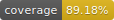

# Pingado-CLI

Command line interface to boilerplating pingado, a express based web application framework.

# Install

You can install via source:

    git clone https://www.github.com/lunhg/pingado-cli.git
	cd pingado-cli
	npm install
	npm test

or by npm, adding the following line in upur terminal:

    npm install -g pingado-cli

# Usage

Create a new application

    pingado create blog

Generate a new .env file with mongodb database configurations 

    pingado env --host localhost --port 27017 --database <database name> --user <database user>. --pwd <database password>

Generate a new mongoose model

    pingado generate mongoose model <Model name>

Generate a new controller that comunicate with your model

    pingado generate mongoose controller <Model name>

Generate a new view for controller

    pingado vue-pug view <model name>

## Macros

- `pingado`: the command name
- `create`: downloads the boilerplate from `https://www.github.com/lunhg/pingado-boilerplate`
- `env`: generate a `.env` customizing your application
- `generate`: downloads different boilerplates
    - `mongoose` and `model` from `https://www.github.com/lunhg/pingado-boilerplate-mongoose-model`
	- `mongoose` and `controller` from `https://www.github.com/lunhg/pingado-boilerplate-mongoose-controller`
	- `vue-pug` and `view` from `https://www.github.com/lunhg/pingado-boilerplate-mongoose-model`

These commands will generate the following file structure:

    blog/
	    app/
		    assets/
			    images/
				css/
				js/
				doc/
			views/
			    layout.pug
				index.pug
				error.pug
				dashboard.vue
				<model>.vue
	        models
				<Model>/
				    model.js
					schema.js
	    routes/
			main.js
		test/
			pingado.opts
			server.js

## Tests

If you want to download the source and test the code yourself, plase edit `test/pingado.opts`
